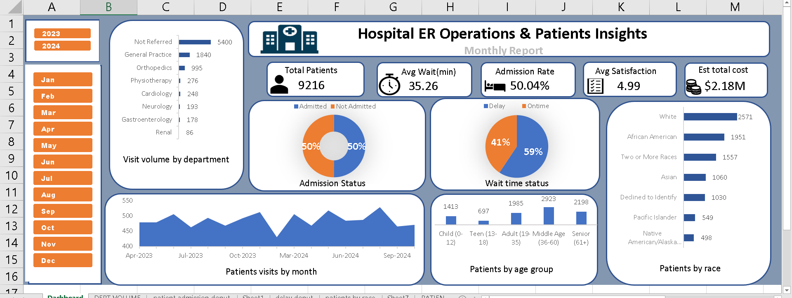

# Hospital ER Operations Dashboard

An interactive Excel dashboard analyzing emergency room operations, patient demographics, and cost metrics using Power Pivot, DAX, and PivotCharts.

## Overview

This dashboard answers a simple question for hospital ER stakeholders: *how is the ER actually performing, day to day and month to month — and who are we treating?* It pulls together patient volume, wait times, admission rates, satisfaction, and cost into a single view, with year/month slicers for drilling into specific periods.

## Features

- Dynamic Year and Month slicers powered by a custom Calendar table built in the Power Pivot Data Model
- KPI cards: total patients, average wait time, admission rate, patient satisfaction, estimated total cost
- Department-level visit volume breakdown
- Admission status and wait-time delay analysis (donut charts)
- Patient demographics by age group and race
- Monthly patient volume trend (area chart)

## Data model

- **Fact table:** Hospital Emergency Room Data (9,200+ records)
- **Lookup tables:** Department Lookup, Age Group Lookup
- **Calendar table:** built with DAX calculated columns, loaded into the Power Pivot Data Model
- Relationships managed in Power Pivot to support slicer-driven filtering across all visuals


## DAX

### Calculated columns

Added directly to the fact table to support the age-group and wait-time-delay visuals.

**Age Group** — buckets patients into age ranges for the demographics chart:
```dax
Age Group =
IF([Patient Age]<=12,"Child (0-12)",
  IF([Patient Age]<=18,"Teen (13-18)",
    IF([Patient Age]<=35,"Adult (19-35)",
      IF([Patient Age]<=60,"Middle Age (36-60)","Senior (61+)"))))
```

**Patient Attend Status** — flags any visit with a wait time over 30 minutes as delayed:
```dax
Patient Attend Status =
IF('Hospital Emergency Room Data'[Patient Waittime]>30,"Delay","Ontime")
```

### KPI measures

Power Pivot measures behind the dashboard's KPI cards.

**Admitted Patients** — count of visits where the patient was admitted:
```dax
Admitted Patients =
CALCULATE(
    COUNTROWS('Hospital Emergency Room Data'),
    'Hospital Emergency Room Data'[Patient Admission Flag]="Admitted"
)
```

**Admission Rate** — admitted patients as a share of total visits:
```dax
Admission Rate =
DIVIDE([Admitted Patients], COUNTROWS('Hospital Emergency Room Data'))
```

**Estimated Cost** — sums each visit's department base cost, with a 1.6x multiplier applied to admitted visits to reflect the higher cost of inpatient care:
```dax
Estimated Cost =
SUMX(
    'Hospital Emergency Room Data',
    RELATED(Department_Lookup_csv_final[Base Cost (USD)])
        * IF('Hospital Emergency Room Data'[Patient Admission Flag]="Admitted", 1.6, 1)
)
```

*Average Wait Time and Average Satisfaction Score use Excel's default implicit measures (AVERAGE) rather than custom DAX.*

## Tools used

Excel · Power Pivot · Power Query · PivotTables · PivotCharts · Slicers · DAX

## Screenshots

 


## Note on data

This dataset is synthetic, practice data created for portfolio/demonstration purposes only. No real patient information is included.
